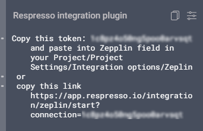
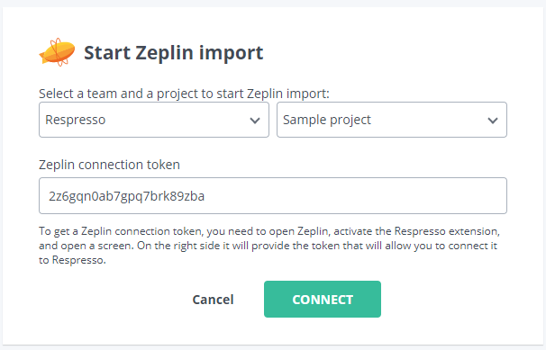
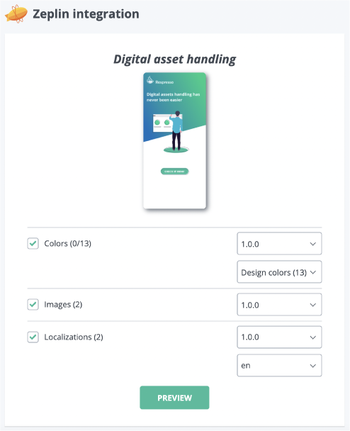
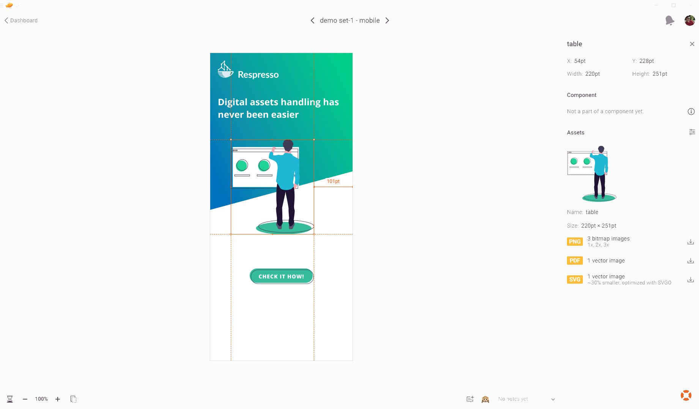
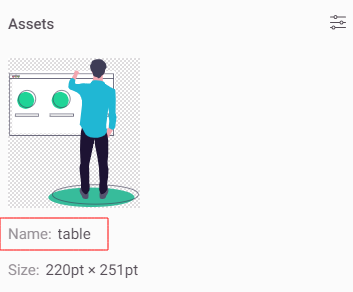
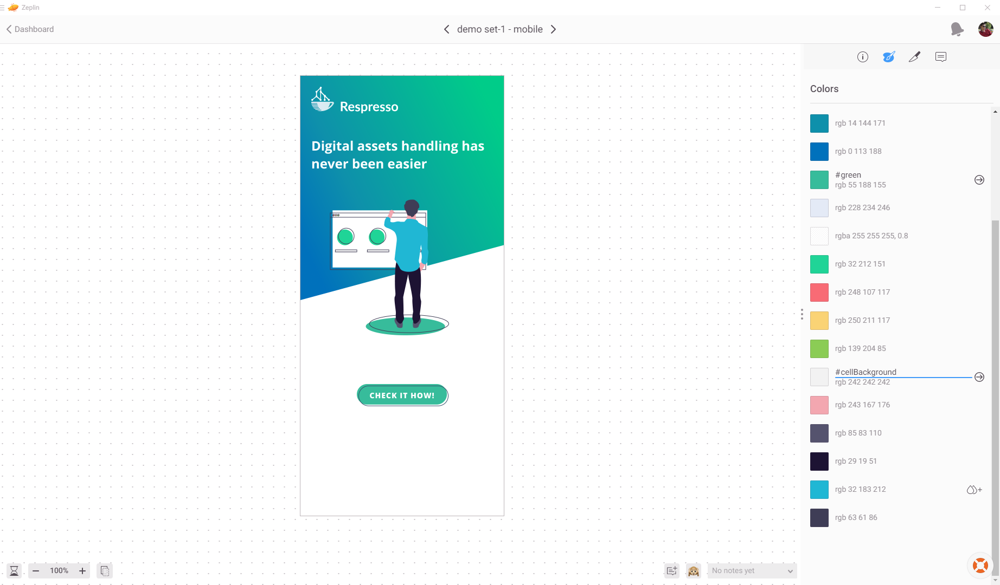

# 🛑 Docs out-of-date notice! 🛑
This documentation is not updated anymore. 
All documentation of Respresso moved to https://respresso.io/docs.
## ✔️ Up-to-date docs of the Zeplin extension is here:
| Content                       | Link                                                                         |
| ----------------------------- | -----------------------------------------------------------------------------|
| Installation + Usage          | https://respresso.io/docs/integration-zeplin-extension                       |
| Config options                | https://respresso.io/docs/integration-introduction                           |
| Localization specific options | https://respresso.io/docs/localization/zeplin-extension                      |
| Image specific options        | https://respresso.io/docs/image/zeplin-extension                             |
| Color specific options        | https://respresso.io/docs/color/zeplin-extension                             |

## Seriously, 🛑 stop 🛑 here and go to the [new docs](https://respresso.io/docs/integration-zeplin-extension)!

---

[

](https://respresso.io)  

# Export assets from Zeplin with Respresso Zeplin extension  
 
## Introduction
We created an integration tool for you to integrate your design assets easily from [Zeplin](https://www.zeplin.io) to [Respresso](https://respresso.io). Zeplin doesn't support processes something like this, that is why integration tool strongly collaborate with Respresso's front end. Let's see how to use the plugin perfectly.
 
## Usage
First of all, [create a project](https://support.zeplin.io/en/articles/367394-creating-a-project) in Zeplin. [Find](https://support.zeplin.io/en/articles/2527608-adding-an-extension-to-a-project#:~:text=To%20add%20one%20of%20those,available%20for%20your%20project%20type.) Respresso extension and add to the project. (Open Respresso module's settings and set your server address if you have an own Respresso server.)

Open a screen in your project's dashboard and wait a little bit while the plugin loads itself. After that you will see a message and a link on the right panel.

Simply copy the link, open a browser and paste it. Login or create an account if you hadn't already do it before. 
 
## Integration settings
 
 ### Project Configuration
 
 

 
 Select a team and a project. Connection token field will be filled automatically.
 This is a temporary token that is needed only for connecting Zeplin with Respresso. Attention, this isn't the same as your project token or integration token for Figma or Adobe XD.

  ### Asset configuration
  
  

  
  In this step Respresso will show you the selected screen's title and a preview image. You can select a version for each asset category and a language for localization texts. 
  
  #### Localizations
  Extension will export your localization strings if you leave the tick in the rect. These texts have a key and value pair inside Zeplin. Value is a simple text that you see in a screen. Key is more complicated than value. You can't find it in Zeplin, it is a hidden field. However, we show you how to change keys if you imported the project from [Figma](https://github.com/respresso/respresso-figma) or [Adobe XD](https://github.com/respresso/respresso-adobexd). Respresso suggests a key usage like these:
	
* section.name_of_the_function.name_of_element (main.menu.log_out)
* section_name_of_the_function_name_of_element (main_menu_log_out)
* connected_to.function_name_of_element (user.log_out)
* etc.
 
Sometimes designers have to modify localization inside the designer tool. We are dedicated to help you and simplify this for developers. Thus, you can simply reimport all of your localization texts. Let's see how we handle it.
 - A new text in your design will also appear as a new one in Respresso
 - Changing a text to the same value on all occurrences will replace the value in Respresso as well
 - Changing a text only in a subset of occurrences will create all the variants in Respresso
 - Removing a text from your design won't affect your assets in Respresso

Don't worry about messing up your keys in Respresso, as keys won't be updated from our integrations, just the values.
 
  #### Images

  

  
  You can export images from Zeplin easily. Attention, Zeplin extension will import images from a screen only if you marked it as an image previously. What does it mean? 
  
  Figma:
  You have to [mark your image as exportable](https://github.com/respresso/respresso-figma#image).
  
  Adobe XD:
  You have to [tick Mark for export option](https://github.com/respresso/respresso-adobexd#image)
  
  Sketch:
  You have to [Make the asset exportable](https://support.zeplin.io/en/articles/367379-exporting-assets-from-sketch)
  
  Your images aren't real part of the project if you skip this step. You will see them in a screen, but Respresso can't export them.
  
  

  
  Respresso supports vector and raster formats, but the extension prefer vector formats. Images have keys as well, and you can modify them. Click an image on the screen and there is the Name field on the right panel.
 Let's see how Respresso solves image modifications. 
  
 - A new image in your design will also appear as a new one in Respresso
 - Changing an image (without name modification) will replace in Respresso as well
 - Changing an image's name will create an image in Respresso  
 - Removing an image from your design won't affect your assets in Respresso
  
  #### Colors

Respresso extension can export all of your colors from Color Palette or from your screen. Palette usage is the preferred way. Respresso supports solid and gradient colors, although gradient colors will split by parts of colors and Respresso exports them like solid colors. Colors have key and value pairs (if you use palette). You can modify the key of a color in the Colors tab by double-clicking the color under Colors section.

Respresso supports updating colors on reimport. Please note that, unlike the other categories, Respresso uses the color's name for matching the stored asset in Respresso. 
	
#### App Icon
Currently, app icon export isn't supported yet.
 
## Preview

The preview page contains information about actions that will be executed in your Respresso project. 
These actions can be:
 - create a new asset
 - update an asset 
 - up-to-date, there isn't any modification 
 
This may help you to follow the import process.

## Import
At the import stage, Respresso's Zeplin extension sends all affected assets to Respresso. This process may take a bit longer.
